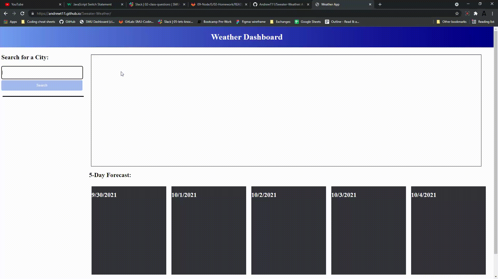

# Sweater-Weather
A weather app for sweater decisions

**Version 1.0**

Sweater Weather Dashboard

## Note 
You are important.

## Installation Instructions
No installation necessary. 
1) Click on live page.
2) Type in City to search
3) Push search.
4) Pray the app halfway works.
4) Get some data you didn't know you needed.

## Acceptance Criteria
Students have completed this project when:

GIVEN a weather dashboard with form inputs
* WHEN I search for a city  
THEN I am presented with current and future conditions for that city and that city is added to the search history 
* WHEN I view current weather conditions for that city 
THEN I am presented with the city name, the date, an icon representation of weather conditions, the temperature, the humidity, the wind speed, and the UV index 
* WHEN I view the UV index 
THEN I am presented with a color that indicates whether the conditions are favorable, moderate, or severe 
* WHEN I view future weather conditions for that city 
THEN I am presented with a 5-day forecast that displays the date, an icon representation of weather conditions, the temperature, the wind speed, and the humidity 
* WHEN I click on a city in the search history 
THEN I am again presented with current and future conditions for that city 

## Screenshot

## Issues
* Past search history not shown
* icons for weather do not appear

## Links
* [Deployed Website Link](https://andrewt11.github.io/Sweater-Weather/)
* [Code Repository Link](https://github.com/AndrewT11/Sweater-Weather)

## Credits
Andrew Tran

### Resources

* https://www.w3schools.com/
* https://developer.mozilla.org/en-US/
* https://choosealicense.com/
* https://openweathermap.org/
* https://www.stackoverflow.com

### License
Copyright (c) [2021] [Andrew Tran]

Permission is hereby granted, free of charge, to any person obtaining a copy
of this software and associated documentation files (the "Software"), to deal
in the Software without restriction, including without limitation the rights
to use, copy, modify, merge, publish, distribute, sublicense, and/or sell
copies of the Software, and to permit persons to whom the Software is
furnished to do so, subject to the following conditions:

The above copyright notice and this permission notice shall be included in all
copies or substantial portions of the Software.

THE SOFTWARE IS PROVIDED "AS IS", WITHOUT WARRANTY OF ANY KIND, EXPRESS OR
IMPLIED, INCLUDING BUT NOT LIMITED TO THE WARRANTIES OF MERCHANTABILITY,
FITNESS FOR A PARTICULAR PURPOSE AND NONINFRINGEMENT. IN NO EVENT SHALL THE
AUTHORS OR COPYRIGHT HOLDERS BE LIABLE FOR ANY CLAIM, DAMAGES OR OTHER
LIABILITY, WHETHER IN AN ACTION OF CONTRACT, TORT OR OTHERWISE, ARISING FROM,
OUT OF OR IN CONNECTION WITH THE SOFTWARE OR THE USE OR OTHER DEALINGS IN THE
SOFTWARE.